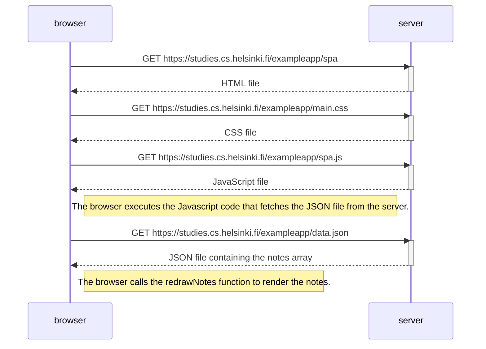

```mermaid
sequenceDiagram
    participant browser
    participant server

    browser->>server: GET https://studies.cs.helsinki.fi/exampleapp/spa
    activate server 
    server-->>browser: HTML file 
    deactivate server

    browser->>server: GET https://studies.cs.helsinki.fi/exampleapp/main.css
    activate server 
    server-->>browser: CSS file 
    deactivate server 

    browser->>server: GET https://studies.cs.helsinki.fi/exampleapp/spa.js
    activate server 
    server-->>browser: JavaScript file 
    deactivate server

    Note right of browser: The browser executes the Javascript code that fetches the JSON file from the server.

    browser->>server: GET https://studies.cs.helsinki.fi/exampleapp/data.json
    activate server 
    server-->>browser: JSON file containing the notes array 
    deactivate server 

    Note right of browser: The browser calls the redrawNotes function to render the notes. 
```