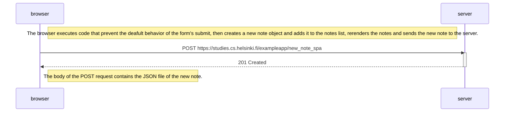

```mermaid 
sequenceDiagram 
    participant browser
    participant server 

    Note right of browser: The browser executes code that prevent the deafult behavior of the form's submit, then creates a new note object and adds it to the notes list, rerenders the notes and sends the new note to the server. 

    browser->>server: POST https://studies.cs.helsinki.fi/exampleapp/new_note_spa     
    activate server 
    server-->>browser: 201 Created
    deactivate server

    Note right of browser: The body of the POST request contains the JSON file of the new note. 
```